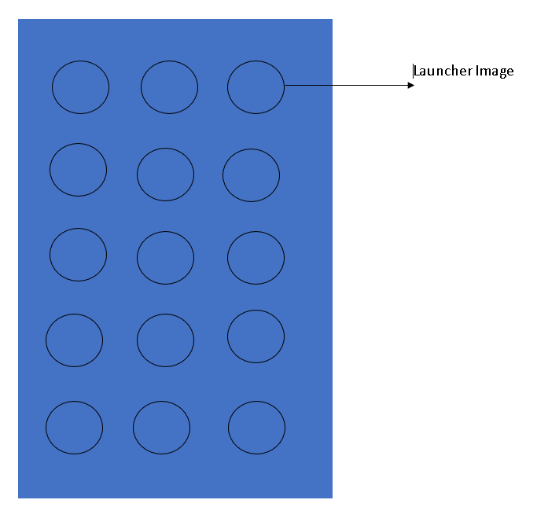
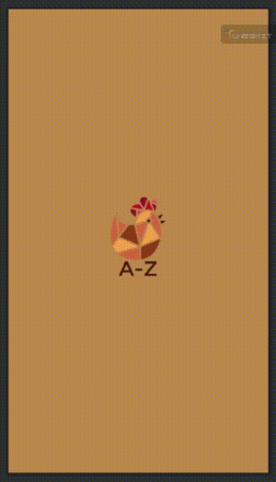

# **A-Z APP**
```
Nama    : 
NIM     : 
Kelas   : TI.22.A.4
Matkul  : Pemrograman Mobile 1
Dosen   : Donny Maulana, S.Kom., M.M.S.I.
```
# **Daftar Isi**
**[Tugas 1](#tugas-1)**

**[Tugas 2](#tugas-2)**

**[Penjelasan Program](#penjelasan-program)**

**[Demo Aplikasi](#demo-aplikasi)**

## **Tugas 1**
Buatkanlah :

1. Launcher Splash logo masing-masing Individu 

2. Buatkanlah untuk menampilkan semua project sebelum UTS dengan metode Ekplisit Intent dan

     Implisit Intent:

    a. Project Hallo

    b. Project Count

    c. Project Sianida

    d. Project TwoActivity

    e. Project Set Alarm

Untuk tampilan Layout Bebas, terima kasih.

## **Tugas 2**
Buatlah tampilan menu Versi 02 dari project-project yang sudah dibuat sebelumnya 

dengan tambahan memanggil method Maps

dengan tampilan sebagai berikut :

 


## **Penjelasan Program**
Membuat Menu untuk menampilkan semua project, disini saya terdapat 6 project. Berikut adalah kode program pada java dan layout xml.

1. **MenuActivity.java**
Program di atas adalah `MenuActivity` yang bertindak sebagai pengontrol untuk layar menu utama aplikasi. Berikut adalah penjelasan untuk setiap fungsi dalam program tersebut:

    1. **`onCreate`**: Metode ini dipanggil saat aktivitas  dibuat. Di sini, tata letak aktivitas diinisialisasi dengan menggunakan layout dari file XML `activity_menu.xml`. Selain itu, enam `CardView` yang mewakili menu aplikasi diinisialisasi.

        ```java
        @Override
        protected void onCreate(Bundle savedInstanceState) {
            super.onCreate(savedInstanceState);
            setContentView(R.layout.activity_menu);

            // Inisialisasi CardView untuk setiap tombol menu
            tombolSatu = findViewById(R.id.cdMenu1);
            tombolDua = findViewById(R.id.cdMenu2);
            tombolTiga = findViewById(R.id.cdMenu3);
            tombolEmpat = findViewById(R.id.cdMenu4);
            tombolLima = findViewById(R.id.cdMenu5);
            tombolEnam = findViewById(R.id.cdMenu6);
        }
        ```

    2. **Tombol Menu 1 (`tombolSatu`)**:
    - Ketika `tombolSatu` ditekan, sebuah objek `Intent` dibuat untuk memulai `HelloActivity`.
    - Metode `startActivity(intent)` memulai aktivitas baru berdasarkan intent yang diberikan.

        ```java
        tombolSatu.setOnClickListener(new View.OnClickListener() {
            @Override
            public void onClick(View v) {
                Intent intent = new Intent(MenuActivity.this, HelloActivity.class);
                startActivity(intent);
            }
        });
        ```

    3. **Tombol Menu 2 sampai Menu 6**:
    - Setiap tombol menu lainnya (`tombolDua` hingga `tombolEnam`) memiliki logika yang serupa dengan `tombolSatu`.
    - Mereka memiliki fungsi `setOnClickListener` yang membuat objek `Intent` untuk memulai aktivitas yang sesuai ketika tombol ditekan.

        ```java
        tombolDua.setOnClickListener(new View.OnClickListener() {
            @Override
            public void onClick(View v) {
                Intent intent = new Intent(MenuActivity.this, MainActivity.class);
                startActivity(intent);
            }
        });
        ```

    Dengan cara ini, `MenuActivity` berfungsi sebagai pemandu untuk memulai berbagai aktivitas dalam aplikasi saat tombol-tombol menu yang sesuai ditekan.
    Berikut adalah penjelasan untuk setiap fungsi dalam kelas `MenuActivity`.

2. **activity_menu.xml**

    disini saya tidak menampilkan kode programnya karna panjang, saya akan menampilkan design dan component apa saja yang digunakan.

    [activity_menu.xml](layout/activity_menu.xml)

    Sumber icon -->
    [www.flaticon.com](https://www.flaticon.com/)

3. **SplashActivity.java**
Program di atas adalah `SplashActivity`, yang berfungsi sebagai tampilan pengantar (splash screen) untuk aplikasi. Di bawah ini adalah penjelasan untuk setiap bagian program:

    1. **`onCreate`**: Metode ini dipanggil saat aktivitas dibuat. Di sini, tata letak aktivitas diinisialisasi dengan menggunakan layout dari file XML `activity_splash.xml`. Selain itu, status bar (bilah notifikasi) diatur untuk disembunyikan sehingga splash screen dapat menutupi seluruh layar.

    ```java
    View decorView = getWindow().getDecorView();
    decorView.setSystemUiVisibility(View.SYSTEM_UI_FLAG_FULLSCREEN);
    ```

    2. **Penundaan dan Pindah ke `MenuActivity`**:
    - Menerapkan penundaan menggunakan objek `Handler` untuk menunda pindah ke `MenuActivity` selama 3 detik (sesuai dengan nilai `SPLASH_DELAY`).
    - Setelah penundaan, objek `Intent` dibuat untuk memulai `MenuActivity`.
    - `startActivity(intent)` memulai aktivitas baru berdasarkan intent yang diberikan.
    - Opsional: `finish()` digunakan untuk menutup `SplashActivity` setelah membuka `MenuActivity`, sehingga pengguna tidak dapat kembali ke splash screen menggunakan tombol "Back".

        ```java
        new Handler().postDelayed(new Runnable() {
            @Override
            public void run() {
                Intent intent = new Intent(SplashActivity.this, MenuActivity.class);
                startActivity(intent);
                finish(); // Optional: ditambahkan untuk menutup SplashActivity setelah membuka MenuActivity
            }
        }, SPLASH_DELAY);
        ```

    Dengan cara ini, `SplashActivity` bertindak sebagai tampilan pembuka yang memberikan kesan singkat sebelum pengguna melihat layar utama (`MenuActivity`). Penundaan memberikan waktu singkat untuk menampilkan merek atau elemen desain yang mewakili aplikasi sebelum memasuki pengalaman pengguna utama.


4. **activity_splash.xml**              


5. **MapActivity.java**
    ```xml
        <?xml version="1.0" encoding="utf-8"?>
        <RelativeLayout xmlns:android="http://schemas.android.com/apk/res/android"
            xmlns:tools="http://schemas.android.com/tools"
            android:layout_width="match_parent"
            android:layout_height="match_parent"
            android:padding="16dp"
            tools:context=".MapActivity">

            <RelativeLayout xmlns:android="http://schemas.android.com/apk/res/android"
                xmlns:tools="http://schemas.android.com/tools"
                android:layout_width="match_parent"
                android:layout_height="match_parent"
                android:padding="16dp"
                tools:context=".MapActivity">
            </RelativeLayout>

        </RelativeLayout>
    ```

    Program di atas adalah implementasi sederhana dari `MapActivity` yang bertujuan untuk menampilkan peta pada koordinat lokasi tertentu. Berikut adalah penjelasan setiap fungsi dalam program tersebut:

    1. **`onCreate(Bundle savedInstanceState)`**
    - Ini adalah metode yang dipanggil saat aktivitas dibuat. Di dalamnya, layout aktivitas diatur menggunakan `setContentView(R.layout.activity_map)`.
    - Koordinat lokasi (latitude dan longitude) sebagai contoh ditentukan (dalam hal ini, menunjuk ke San Francisco).

    2. **`showMap(Uri geoLocation)`**
    - Ini adalah metode khusus yang dibuat untuk menampilkan peta berdasarkan koordinat lokasi yang diberikan.
    - Metode ini menerima parameter `Uri geoLocation`, yang mewakili lokasi pada peta.
    - Membuat objek `Intent` dengan tindakan `Intent.ACTION_VIEW` untuk menampilkan peta.
    - Mengatur data lokasi pada `Intent` menggunakan `intent.setData(geoLocation)`.
    - Memeriksa apakah ada aplikasi yang dapat menangani tindakan ini dengan menggunakan `resolveActivity(getPackageManager())`.
    - Jika ada aplikasi yang dapat menangani tindakan tersebut, `startActivity(intent)` digunakan untuk memulai aktivitas tersebut, yaitu menampilkan peta pada lokasi yang ditentukan.

        Pada `onCreate`, koordinat lokasi diatur, dan kemudian fungsi `showMap` dipanggil dengan Uri yang dibuat dari koordinat tersebut. Sebagai contoh, koordinat yang digunakan adalah untuk San Francisco. Setelah itu, peta akan ditampilkan jika ada aplikasi yang dapat menangani tindakan tersebut di perangkat pengguna.

        Pastikan bahwa aplikasi Android Anda memiliki izin dan konfigurasi yang benar untuk menggunakan fitur peta. Ini termasuk menyertakan izin yang diperlukan di dalam file manifest dan memastikan bahwa pustaka peta atau aplikasi peta yang sesuai terinstal di perangkat.


6. **activity_map.xml**
    ```java
    // MapActivity.java
    package androidx.constraintlayout.widget.jokiapp;

    import androidx.appcompat.app.AppCompatActivity;

    import android.content.Intent;
    import android.net.Uri;
    import android.os.Bundle;

    public class MapActivity extends AppCompatActivity {

        @Override
        protected void onCreate(Bundle savedInstanceState) {
            super.onCreate(savedInstanceState);
            setContentView(R.layout.activity_map);

            // Koordinat lokasi (latitude dan longitude) sebagai contoh
            double latitude = 37.7749;
            double longitude = -122.4194;

            // Membuat Uri dari koordinat lokasi
            Uri geoLocation = Uri.parse("geo:" + latitude + "," + longitude);

            // Memanggil metode showMap untuk menampilkan peta
            showMap(geoLocation);
        }

        public void showMap(Uri geoLocation) {
            Intent intent = new Intent(Intent.ACTION_VIEW);
            intent.setData(geoLocation);
            if (intent.resolveActivity(getPackageManager()) != null) {
                startActivity(intent);
            }
        }
    }
    ```
## **Demo Aplikasi**


<hr>

**[Back--->](#a-z-app))**